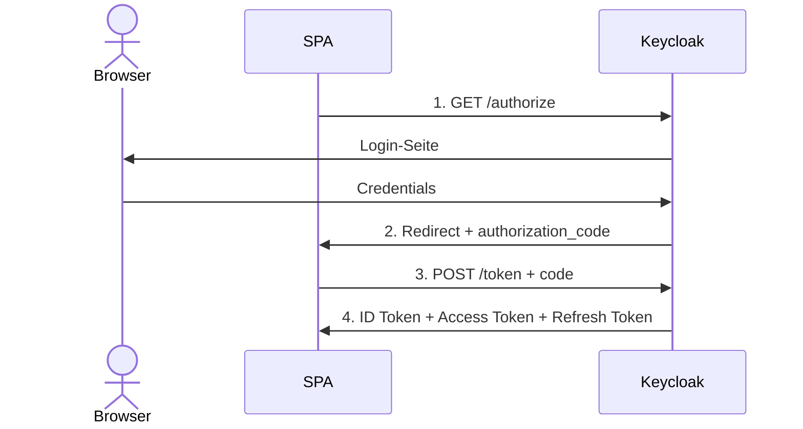
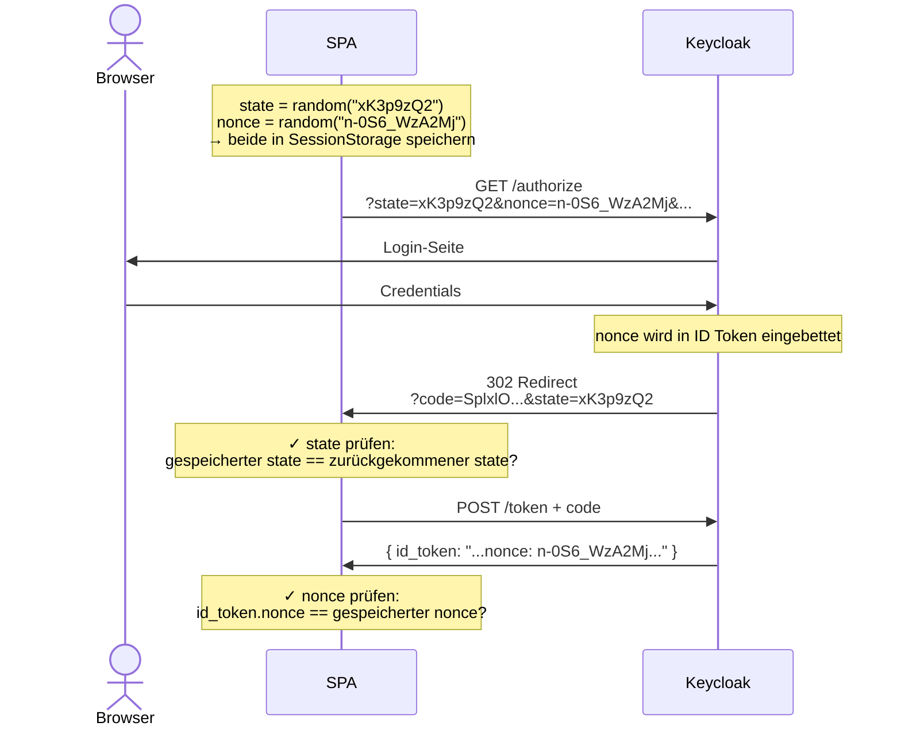
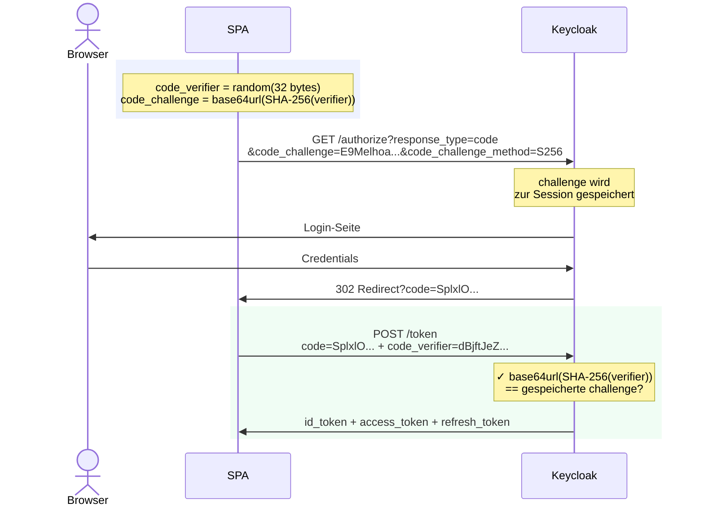
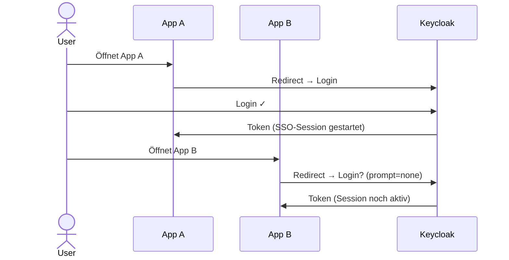
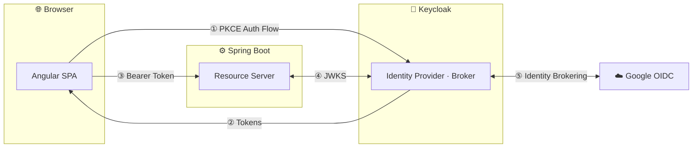
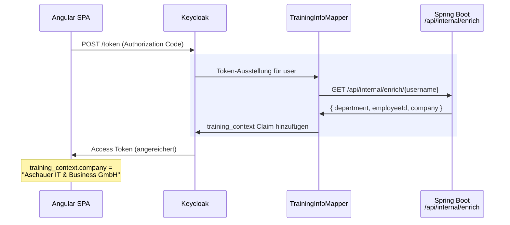
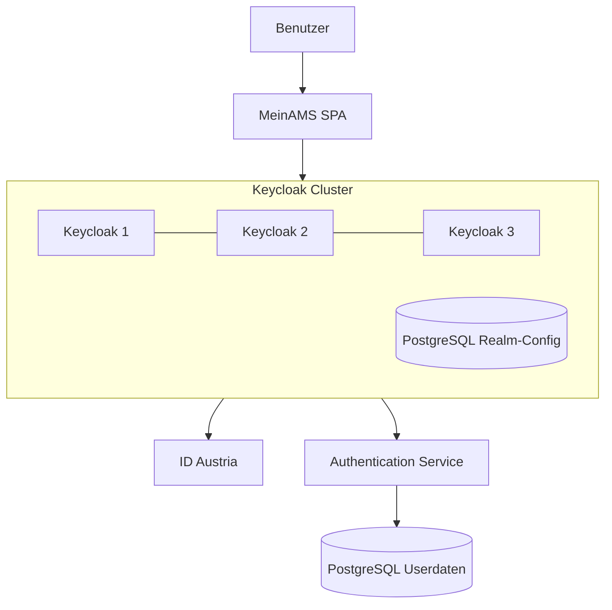

<div class="absolute top-0 left-0 right-0 h-1.5" style="background: linear-gradient(to right, #3b82f6, #6366f1)"></div>

<div class="h-full flex flex-col items-center justify-center text-center">

  <p style="color: #a5b4fc; font-size: 0.7rem; font-weight: 700; letter-spacing: 0.15em; text-transform: uppercase; margin-bottom: 1.5rem">OpenID Connect</p>

  <h1 style="color: #111827; font-size: 3.5rem; font-weight: 800; line-height: 1.1; margin-bottom: 0.75rem">OIDC Schulung</h1>

  <p style="color: #6b7280; font-size: 1.1rem; margin-bottom: 2rem">Internes Training für Entwickler</p>

  <div style="display: flex; gap: 0.5rem; margin-bottom: 3rem; flex-wrap: wrap; justify-content: center">
    <span v-for="tag in ['OIDC', 'OAuth 2.0', 'PKCE', 'Keycloak', 'Angular SPA']" :key="tag"
      style="font-family: monospace; font-size: 0.75rem; font-weight: 600; background: #eef2ff; color: #4f46e5; border-radius: 0.5rem; padding: 0.35rem 0.75rem">
      {{ tag }}
    </span>
  </div>

  <div @click="$slidev.nav.next" style="font-size: 0.85rem; color: #d1d5db; cursor: pointer" class="hover:text-gray-500 transition-colors flex items-center gap-2">
    Weiter mit Leertaste <carbon:arrow-right />
  </div>

</div>

<div class="absolute bottom-6 left-0 right-0 flex justify-between px-12" style="font-size: 0.7rem; color: #d1d5db">
  <span style="font-family: monospace">http://localhost:4200</span>
  <span>{{ new Date().getFullYear() }}</span>
</div>

<style>
.slidev-layout {
  background: #ffffff !important;
}
</style>


---
transition: fade-out
---

# Agenda

<div class="flex gap-3 items-center" style="height: calc(100% - 80px)">

  <!-- Teil 1 -->
  <div class="flex-1 min-w-0 rounded-xl overflow-hidden border border-gray-100 shadow-sm" style="height: 200px">
    <div class="h-1.5 bg-blue-500"></div>
    <div class="p-4">
      <div class="text-xs text-blue-500 font-mono font-semibold mb-1">TEIL 1</div>
      <div class="font-bold text-sm mb-3">Grundlagen</div>
      <div class="flex flex-col gap-1 w-full">
        <span class="text-xs bg-blue-50 text-blue-700 rounded px-2 py-0.5">OIDC</span>
        <span class="text-xs bg-blue-50 text-blue-700 rounded px-2 py-0.5">OAuth 2.0</span>
        <span class="text-xs bg-blue-50 text-blue-700 rounded px-2 py-0.5">Tokens & Ablauf</span>
        <span class="text-xs bg-blue-50 text-blue-700 rounded px-2 py-0.5">Scopes & Claims</span>
      </div>
    </div>
  </div>

  <!-- Teil 2 -->
  <div class="flex-1 min-w-0 rounded-xl overflow-hidden border border-gray-100 shadow-sm" style="height: 200px">
    <div class="h-1.5 bg-violet-500"></div>
    <div class="p-4">
      <div class="text-xs text-violet-500 font-mono font-semibold mb-1">TEIL 2</div>
      <div class="font-bold text-sm mb-3">Authorization Code Flow</div>
      <div class="flex flex-col gap-1 w-full">
        <span class="text-xs bg-violet-50 text-violet-700 rounded px-2 py-0.5">Überblick & Schritte</span>
        <span class="text-xs bg-violet-50 text-violet-700 rounded px-2 py-0.5">State & Nonce</span>
        <span class="text-xs bg-violet-50 text-violet-700 rounded px-2 py-0.5">↳ PKCE</span>
      </div>
    </div>
  </div>

  <!-- Teil 3 -->
  <div class="flex-1 min-w-0 rounded-xl overflow-hidden border border-gray-100 shadow-sm" style="height: 200px">
    <div class="h-1.5 bg-green-500"></div>
    <div class="p-4">
      <div class="text-xs text-green-600 font-mono font-semibold mb-1">TEIL 3</div>
      <div class="font-bold text-sm mb-3">Integration</div>
      <div class="flex flex-col gap-1 w-full">
        <span class="text-xs bg-green-50 text-green-700 rounded px-2 py-0.5">SSO</span>
        <span class="text-xs bg-green-50 text-green-700 rounded px-2 py-0.5">SPA Integration</span>
        <span class="text-xs bg-green-50 text-green-700 rounded px-2 py-0.5">Keycloak Setup</span>
        <span class="text-xs bg-green-50 text-green-700 rounded px-2 py-0.5">Konfiguration</span>
      </div>
    </div>
  </div>

  <div class="flex flex-col items-center justify-center px-1">
    <div class="text-gray-300 text-xs">Pause</div>
  </div>

  <!-- Teil 4 -->
  <div class="flex-1 min-w-0 rounded-xl overflow-hidden border border-gray-100 shadow-sm" style="height: 200px">
    <div class="h-1.5 bg-orange-500"></div>
    <div class="p-4">
      <div class="text-xs text-orange-500 font-mono font-semibold mb-1">TEIL 4</div>
      <div class="font-bold text-sm mb-3">Hands-on</div>
      <div class="flex flex-col gap-1 w-full">
        <span class="text-xs bg-orange-50 text-orange-700 rounded px-2 py-0.5">OIDC Flow</span>
        <span class="text-xs bg-orange-50 text-orange-700 rounded px-2 py-0.5">Demo</span>
      </div>
    </div>
  </div>

  <!-- Mittagspause -->
  <div class="flex flex-col items-center justify-center px-1">
    <div class="text-gray-300 text-xs text-center">Mittags-<br>pause</div>
  </div>

  <!-- Teil 5 -->
  <div class="flex-1 min-w-0 rounded-xl overflow-hidden border border-gray-100 shadow-sm" style="height: 200px">
    <div class="h-1.5 bg-indigo-600"></div>
    <div class="p-4">
      <div class="text-xs text-indigo-600 font-mono font-semibold mb-1">TEIL 5</div>
      <div class="font-bold text-sm mb-3">Real World</div>
      <div class="flex flex-col gap-1 w-full">
        <span class="text-xs bg-indigo-50 text-indigo-700 rounded px-2 py-0.5">MeinAMS</span>
        <span class="text-xs bg-indigo-50 text-indigo-700 rounded px-2 py-0.5">Keycloak Cluster</span>
        <span class="text-xs bg-indigo-50 text-indigo-700 rounded px-2 py-0.5">Custom SPI</span>
      </div>
    </div>
  </div>

</div>

<!--
Kurzer Überblick über den Ablauf. Fragen am besten direkt stellen.
-->

---
layout: section
---

<div class="text-sm font-mono text-blue-400 mb-2 tracking-widest uppercase">Teil 1</div>
<h1 class="text-5xl font-bold text-blue-600">OIDC Grundlagen</h1>
<div class="mt-4 w-16 h-0.5 bg-blue-400"></div>

---

# Was ist OpenID Connect?

<div class="grid grid-cols-2 gap-8 mt-4">
<div>

**OpenID Connect (OIDC)** ist eine Identitätsschicht auf Basis von **OAuth 2.0**.

- Standardisiertes Protokoll zur **Authentifizierung**
- Aufgebaut auf **OAuth 2.0** (Autorisierung)
- Gibt Anwendungen die Möglichkeit, die **Identität eines Nutzers** zu verifizieren
- Verwaltet von der **OpenID Foundation**

</div>
<div class="flex flex-col items-center justify-center h-full gap-2 mt-4">
  <div class="w-full rounded-xl bg-blue-100 border-2 border-blue-400 text-center py-4 px-6">
    <div class="text-blue-700 font-bold text-lg">OpenID Connect</div>
    <div class="text-blue-600 text-sm mt-1">Authentifizierung · ID Token · Wer ist der Nutzer?</div>
  </div>
  <div class="text-gray-400 text-xl">↓ erweitert ↓</div>
  <div class="w-full rounded-xl bg-violet-100 border-2 border-violet-400 text-center py-4 px-6">
    <div class="text-violet-700 font-bold text-lg">OAuth 2.0</div>
    <div class="text-violet-600 text-sm mt-1">Autorisierung · Access Token · Darf die App zugreifen?</div>
  </div>
</div>

</div>


---

# Die wichtigsten Begriffe

<div class="grid grid-cols-2 gap-x-10 gap-y-4 mt-6">

<div class="border-l-4 border-blue-400 pl-4">
  <div class="font-bold text-blue-600">Identity Provider (IdP)</div>
  <div class="text-sm text-gray-600">Authentifiziert Nutzer und stellt Tokens aus. Beispiele: Keycloak, Azure AD, Google</div>
</div>

<div class="border-l-4 border-blue-400 pl-4">
  <div class="font-bold text-blue-600">Client</div>
  <div class="text-sm text-gray-600">Die Anwendung (SPA oder Backend), die im Namen des Nutzers Tokens anfordert.</div>
</div>

<div class="border-l-4 border-violet-400 pl-4">
  <div class="font-bold text-violet-600">Resource Server</div>
  <div class="text-sm text-gray-600">Der API-Server, der geschützte Ressourcen bereitstellt und Access Tokens validiert.</div>
</div>

<div class="border-l-4 border-violet-400 pl-4">
  <div class="font-bold text-violet-600">Tokens</div>
  <div class="text-sm text-gray-600">ID Token (Nutzeridentität), Access Token (Zugriffsberechtigung), Refresh Token (erneuert Access Tokens)</div>
</div>

<div class="border-l-4 border-green-400 pl-4">
  <div class="font-bold text-green-600">Scope</div>
  <div class="text-sm text-gray-600">Berechtigungsanfrage des Clients. Bestimmt, welche Claims im Token landen. z. B. <code>openid</code>, <code>profile</code></div>
</div>

<div class="border-l-4 border-green-400 pl-4">
  <div class="font-bold text-green-600">Claims</div>
  <div class="text-sm text-gray-600">Schlüssel-Wert-Paare im Token - Aussagen über den Nutzer. z. B. <code>sub</code>, <code>name</code>, <code>email</code></div>
</div>

</div>


---

# Scopes & Claims

<div class="grid grid-cols-2 gap-6 mt-3">
<div class="text-sm">

### Scopes - was wird angefragt?

Scopes sind **Berechtigungsanfragen** des Clients. Der Nutzer stimmt ihnen beim Login zu.

| Scope | Enthaltene Infos |
|---|---|
| `openid` | `sub` (Pflicht für OIDC) |
| `profile` | `name`, `given_name`, … |
| `email` | `email` |

<div class="mt-2 text-gray-500">

`scope=openid profile email`

</div>
</div>
<div class="text-sm">

### Claims - was steht im Token?

Claims sind die **tatsächlichen Daten** im JWT-Payload. Ein Scope bestimmt, welche Claims ausgestellt werden.

```json
{ 
  "sub": "user-abc123",       // openid
  "name": "Max Mustermann",   // profile
  "email": "max@example.com", // email
  "roles": ["admin"]          // custom 
}       
```
</div>
</div>


---

# OAuth 2.0 vs. OpenID Connect

<div class="grid grid-cols-2 gap-6 mt-5">

<div class="rounded-xl overflow-hidden border border-gray-100 shadow-sm">
  <div class="h-1.5 bg-gray-400"></div>
  <div class="p-5">
    <div class="text-gray-500 text-xs font-mono font-semibold mb-1 tracking-widest uppercase">OAuth 2.0</div>
    <div class="font-bold text-base mb-3">Autorisierung</div>
    <div class="text-sm text-gray-500 italic mb-4">"Die App darf auf meine Google Drive Dateien zugreifen."</div>
    <div class="flex flex-col gap-2 text-sm mb-4">
      <div class="flex gap-2 items-start"><span class="text-gray-400 mt-0.5">→</span><span>Ergebnis: <strong>Access Token</strong></span></div>
      <div class="flex gap-2 items-start"><span class="text-gray-400 mt-0.5">→</span><span>Berechtigung für API-Zugriff</span></div>
      <div class="flex gap-2 items-start"><span class="text-gray-400 mt-0.5">→</span><span>Nutzeridentität: <strong>unbekannt</strong></span></div>
    </div>
    <div class="rounded-lg bg-gray-50 px-3 py-2 font-mono text-xs text-gray-500">
      scope=drive.readonly<br>
      → Access Token
    </div>
  </div>
</div>

<div class="rounded-xl overflow-hidden border border-blue-100 shadow-sm">
  <div class="h-1.5 bg-blue-500"></div>
  <div class="p-5">
    <div class="text-blue-500 text-xs font-mono font-semibold mb-1 tracking-widest uppercase">OpenID Connect</div>
    <div class="font-bold text-base mb-3">Authentifizierung + Autorisierung</div>
    <div class="text-sm text-gray-500 italic mb-4">"Die App hat Informationen über meine Persönlichen Daten."</div>
    <div class="flex flex-col gap-2 text-sm mb-4">
      <div class="flex gap-2 items-start"><span class="text-blue-400 mt-0.5">→</span><span>Ergebnis: Access Token <strong>+ ID Token</strong></span></div>
      <div class="flex gap-2 items-start"><span class="text-blue-400 mt-0.5">→</span><span>ID Token enthält <strong>Nutzeridentität</strong></span></div>
      <div class="flex gap-2 items-start"><span class="text-blue-400 mt-0.5">→</span><span>Nutzerinfos können auch direkt in den <strong>Access Token</strong> gemappt werden</span></div>
      <div class="flex gap-2 items-start"><span class="text-blue-400 mt-0.5">→</span><span>Scope <code>openid</code> aktiviert OIDC</span></div>
    </div>
    <div class="rounded-lg bg-blue-50 px-3 py-2 font-mono text-xs text-blue-600">
      scope=openid profile email<br>
      → Access Token + ID Token
    </div>
  </div>
</div>

</div>


---

# Tokens im Überblick

<div class="grid grid-cols-3 gap-5 mt-4">

<div class="rounded-xl bg-green-50 p-5 text-sm">
  <div class="text-green-600 font-bold text-base mb-3">ID Token</div>
  <p>JWT mit <strong>Nutzeridentität</strong></p>
  <p class="mt-1">→ Für die <strong>Client-App</strong></p>
  <p class="mt-1 text-gray-500">Enthält: <code>sub</code>, <code>name</code>, <code>email</code>, <code>exp</code></p>
  <p class="text-red-500 font-medium mt-3">✗ Nie an APIs weitergeben</p>
</div>

<div class="rounded-xl bg-blue-50 p-5 text-sm">
  <div class="text-blue-600 font-bold text-base mb-3">Access Token</div>
  <p>JWT mit <strong>Berechtigungen</strong></p>
  <p class="mt-1">→ Für den <strong>Resource Server</strong></p>
  <p class="mt-1 text-gray-500">Enthält: <code>scope</code>, <code>roles</code>, <code>exp</code></p>
  <p class="text-gray-400 mt-3">Kurzlebig (Minuten)</p>
</div>

<div class="rounded-xl bg-amber-50 p-5 text-sm">
  <div class="text-amber-600 font-bold text-base mb-3">Refresh Token</div>
  <p>Erneuert <strong>Access Tokens</strong></p>
  <p class="mt-1">→ Kein erneuter Login nötig</p>
  <p class="mt-1 text-gray-500">Opaker String (kein JWT)</p>
  <p class="text-red-500 font-medium mt-3">⚠ Sicher speichern!</p>
</div>

</div>

<div v-click class="mt-5 text-sm">

```json
// ID Token Payload (dekodiert)
{ "sub": "user-123", "email": "max@example.com", "name": "Max Mustermann",
  "iss": "https://keycloak/realm", "aud": "my-app", "exp": 1710000000 }
```

</div>


---

# JSON Web Token (JWT)

<div class="grid grid-cols-2 gap-6 mt-4">
<div>

### Aufbau: 3 Base64url-Segmente

<div class="font-mono text-xs bg-gray-100 rounded-lg px-3 py-2 leading-6 mt-2">
  <span class="text-gray-400">Header:  </span><span class="text-red-500">eyJhbGciOiJSUzI1NiJ9</span><br>
  <span class="text-gray-400">Payload: </span><span class="text-violet-600">eyJzdWIiOiJ1c2VyLTEyMyJ9</span><br>
  <span class="text-gray-400">Sig:     </span><span class="text-green-600">SflKxwRJSMeKKF2QT4fw...</span>
</div>

<span class="text-red-500 font-bold">Header</span> - Algorithmus & Token-Typ
```json
{ "alg": "RS256", "typ": "JWT" }
```

<span class="text-violet-600 font-bold">Payload</span> - Claims (die eigentlichen Daten)
```json
{ "sub": "user-123", "name": "Max", "exp": 1710000000 }
```

<span class="text-green-600 font-bold">Signatur</span> - Integrität & Herkunft
```
RS256( base64url(header) + "." + base64url(payload), privateKey )
```

</div>
<div>

### Validierung ohne Roundtrip

Der Resource Server prüft die Signatur mit dem **Public Key des IdP** (via JWKS Endpoint) - ganz ohne Keycloak zu kontaktieren.

<div class="mt-4 rounded-lg bg-amber-50 px-4 py-3 text-sm text-amber-800">
⚠️ JWTs sind nur <strong>Base64url-kodiert</strong>, nicht verschlüsselt.<br>
Der Payload ist für jeden lesbar → <strong>keine Secrets im Token!</strong>
</div>

<div class="mt-3 rounded-lg bg-gray-50 px-4 py-3 text-sm text-gray-500">
→ Dekodieren & prüfen: <strong>jwt.io</strong>
</div>

</div>
</div>

<!--
RS256 = RSA mit SHA-256. Keycloak signiert mit dem Private Key, der Resource Server validiert mit dem Public Key.
Stateless: kein Roundtrip zum IdP nötig - das ist der Hauptvorteil gegenüber Opaque Tokens.
-->

---
layout: section
---

<div class="text-sm font-mono text-violet-400 mb-2 tracking-widest uppercase">Teil 2</div>
<h1 class="text-5xl font-bold text-violet-600">Authorization Code Flow</h1>
<div class="mt-4 w-16 h-0.5 bg-violet-400"></div>

---

# Authorization Code Flow - Überblick

Der **Authorization Code Flow** ist der empfohlene OAuth 2.0 Flow für alle Clients, die einen Nutzer authentifizieren müssen.

**Kernprinzip:** Die App bekommt nie direkt ein Token — stattdessen erst einen kurzlebigen **Authorization Code**, der dann gegen Tokens eingetauscht wird.

<div class="grid grid-cols-2 gap-4 mt-6">
  <div class="rounded-lg border border-violet-100 bg-violet-50 px-4 py-3">
    <span class="text-violet-700 font-semibold text-sm">Geeignet für</span>
    <p class="text-sm text-gray-600 mt-1">SPAs, Web Apps, Native Apps, Backend-to-Backend</p>
  </div>
  <div class="rounded-lg border border-gray-100 bg-gray-50 px-4 py-3">
    <span class="text-gray-500 font-semibold text-sm">Nicht mehr empfohlen</span>
    <p class="text-sm text-gray-400 mt-1">Implicit Flow (Token direkt im Redirect), Resource Owner Password Flow</p>
  </div>
</div>

---

# Authorization Code Flow - Die 4 Schritte



---

# State & Nonce

<div class="grid grid-cols-2 gap-8 mt-4">
<div>

### `state` - CSRF-Schutz

- Zufälliger Wert, den die SPA vor dem Redirect generiert
- Wird mit dem Authorization Request mitgeschickt
- Kommt im Callback **unverändert zurück**
- SPA prüft: stimmt der Wert überein?

```
GET /authorize?...&state=xK3p9zQ2
→ callback?code=...&state=xK3p9zQ2 ✓
```

<div class="mt-2 rounded-lg bg-red-50 px-3 py-2 text-xs text-red-700">
Abweichender <code>state</code> = möglicher CSRF-Angriff → Request verwerfen
</div>

</div>
<div>

### `nonce` - Replay-Schutz

- Zufälliger Wert, der im **ID Token** als Claim landet
- SPA prüft: nonce im Token == gesendeter nonce?
- Verhindert, dass ein altes Token erneut eingespielt wird

```json
// ID Token Payload
{ "nonce": "n-0S6_WzA2Mj", ... }
```

<div class="mt-2 rounded-lg bg-amber-50 px-3 py-2 text-xs text-amber-700">
Beide Parameter sollten kryptografisch zufällig sein - keine vorhersehbaren Werte!
</div>

</div>
</div>

---

# State & Nonce - Ablauf im Flow



---

# Warum PKCE?

<div class="grid grid-cols-2 gap-8">
<div>

### Das Problem bei SPAs & Native Apps

- **Kein sicheres Client Secret** möglich
  - JavaScript-Code ist öffentlich einsehbar
  - Native Apps können inspiziert werden
- Authorization Code kann **abgefangen** werden
  - Malicious Apps mit gleichem Redirect URI
  - Code Injection in Redirects

</div>
<div v-click>

### Die Lösung: PKCE

**Proof Key for Code Exchange** (RFC 7636)

- Kein Secret nötig
- Client erzeugt **einmaliges Schlüsselpaar** pro Flow
- Code Verifier (geheim) + Code Challenge (öffentlich)
- Authorization Code ist **an die Challenge gebunden**
- Angreifer ohne Verifier kann Code nicht nutzen

</div>
</div>

<!--
PKCE wurde ursprünglich für Mobile Apps entwickelt, ist aber heute Best Practice für alle öffentlichen Clients.
Seit OAuth 2.1 ist PKCE Pflicht für public clients.
-->

---

# PKCE: Code Verifier & Code Challenge

<div class="grid grid-cols-2 gap-8 mt-4">
<div>

### Code Verifier
- Zufälliger String (43-128 Zeichen)
- Nur Base64url-Zeichen: `[A-Z a-z 0-9 - . _ ~]`
- Wird **nur im Client** gespeichert (Memory!)
- Niemals übertragen beim Authorization Request

```js
const verifier = base64url(
  crypto.randomBytes(32)
)
```

</div>
<div>

### Code Challenge
- Abgeleitet aus dem Code Verifier
- Methode `S256` (SHA-256, empfohlen) oder `plain`

```js
const challenge = base64url(
  sha256(verifier)
)
```

- Wird **mit dem Authorization Request** gesendet
- IdP speichert sie zum späteren Vergleich

</div>
</div>

<!--
S256 ist immer zu bevorzugen - "plain" nur wenn S256 nicht unterstützt wird (sollte nicht vorkommen).
Der Verifier darf nie persistiert werden, nur im Arbeitsspeicher halten!
-->

---

# PKCE Flow: Schritt für Schritt



<!--
Der kritische Schritt ist der Token Request: Der IdP kann den Verifier prüfen, ohne ihn je gespeichert zu haben.
Ein Angreifer, der den Authorization Code stiehlt, hat keinen Verifier und kann keinen Token holen.
-->

---

# Schritt 1: Authorization Request

SPA leitet den Browser zum IdP weiter.

<pre class="text-xs font-mono bg-gray-100 px-4 py-3 rounded-lg leading-6">GET /realms/demo/protocol/openid-connect/auth HTTP/1.1
Host: keycloak.example.com

  ?response_type=code
  &amp;client_id=my-spa
  &amp;redirect_uri=https://app.example.com/callback
  &amp;scope=openid profile email
  &amp;<span style="color:#c2410c;font-weight:600">state=xK3p9zQ2</span>
  &amp;<span style="color:#7c3aed;font-weight:600">nonce=n-0S6_WzA2Mj</span>
  &amp;<span style="color:#15803d;font-weight:600">code_challenge=E9Melhoa2OwvFrEMTJguCHaoeK1t8URWbuGJSstw-cM</span>
  &amp;code_challenge_method=S256</pre>

<div class="grid grid-cols-2 gap-4 mt-2 text-sm">
<div>

- `scope=openid` - aktiviert OIDC (ohne diesen Parameter: reines OAuth 2.0)
- <span style="color:#c2410c;font-weight:600">state</span> - zufälliger Wert, kommt in Schritt 2 zurück (CSRF-Schutz)
- <span style="color:#7c3aed;font-weight:600">nonce</span> - zufälliger Wert, taucht im ID Token wieder auf (Replay-Schutz)

</div>
<div>

- <span style="color:#15803d;font-weight:600">code_challenge</span> - `SHA-256(code_verifier)`, wird in Schritt 3 geprüft
- `code_challenge_method=S256` - gibt den Hash-Algorithmus an

</div>
</div>

<!--
scope=openid ist der Schlüssel: erst damit wird OAuth zu OIDC.
state verhindert CSRF-Angriffe.
code_challenge = SHA-256(code_verifier) - wird in Schritt 3 verifiziert.
-->

---

# Schritt 2: Authorization Response

Nach erfolgreichem Login leitet der IdP zurück zur App.

<pre class="text-sm font-mono bg-gray-100 p-4 rounded-lg leading-7">HTTP/1.1 302 Found
Location: https://app.example.com/callback
  ?<span style="color:#1d4ed8;font-weight:600">code=SplxlOBeZQQYbYS6WxSbIA</span>
  &amp;<span style="color:#c2410c;font-weight:600">state=xK3p9zQ2</span></pre>

<div class="grid grid-cols-2 gap-6 mt-6 text-sm">
<div>

- <span style="color:#1d4ed8;font-weight:600">code</span> - kurzlebiger Authorization Code (~60 Sek., einmalig)
- Noch **kein Token** - nur ein Einlöseschein

</div>
<div>

- <span style="color:#c2410c;font-weight:600">state</span> - muss mit Schritt 1 übereinstimmen (CSRF-Check)
- Bei Abweichung: **Request verwerfen**

</div>
</div>

<!--
Der Authorization Code ist wertlos ohne den code_verifier.
state kommt aus Schritt 1 zurück - Wert muss identisch sein.
-->

---

# Schritt 3: Token Request

SPA tauscht den Code gegen Tokens ein.

<pre class="text-sm font-mono bg-gray-100 p-4 rounded-lg leading-7">POST /realms/demo/protocol/openid-connect/token HTTP/1.1
Host: keycloak.example.com
Content-Type: application/x-www-form-urlencoded

grant_type=authorization_code
&amp;<span style="color:#1d4ed8;font-weight:600">code=SplxlOBeZQQYbYS6WxSbIA</span>
&amp;redirect_uri=https://app.example.com/callback
&amp;client_id=my-spa
&amp;<span style="color:#15803d;font-weight:600">code_verifier=dBjftJeZ4CVP-mB92K27uhbUJU1p1r_wW1gFWFOEjXk</span></pre>

<div class="grid grid-cols-2 gap-6 mt-3 text-sm">
<div>

- <span style="color:#1d4ed8;font-weight:600">code</span> - derselbe Authorization Code aus Schritt 2
- <span style="color:#15803d;font-weight:600">code_verifier</span> - das Original-Secret

</div>
<div>

- IdP prüft: <span style="color:#15803d;font-weight:600">code_challenge</span> aus Schritt 1 ✓
- Bei Mismatch: **Token wird verweigert**

</div>
</div>

<!--
Das ist der PKCE-Kernmechanismus: Wer den Code gestohlen hat, kennt den Verifier nicht.
-->

---

# Schritt 4: Token Response

IdP antwortet mit drei Tokens.

<div class="grid grid-cols-2 gap-5">
<div>

<pre class="text-sm font-mono bg-gray-100 p-4 rounded-lg leading-7">{
  "id_token":      "eyJhbGciOiJSUzI1NiJ9...",
  "access_token":  "eyJhbGciOiJSUzI1NiJ9...",
  "token_type":    "Bearer",
  "refresh_token": "8xLOxBtZp8vRHXkgHQu...",
  "expires_in":    300
}</pre>

<div class="grid grid-cols-3 gap-3 mt-3 text-xs">
<div>

**ID Token** - JWT für die App
Enthält: `sub`, `name`, `email`

</div>
<div>

**Access Token** - für APIs
Enthält: `scope`, `roles`, `exp`

</div>
<div>

**Refresh Token**
Erneuert Access Tokens

</div>
</div>

</div>
<div>

<pre class="text-sm font-mono bg-gray-100 p-4 rounded-lg leading-7"><span class="text-gray-400">// ID Token (dekodiert)</span>
{
  "sub":   "user-abc123",
  "email": "max@example.com",
  "iss":   "https://keycloak/realms/demo",
  "aud":   "my-spa",
  "exp":   1710000000,
  "<span style="color:#7c3aed;font-weight:600">nonce</span>": "<span style="color:#7c3aed;font-weight:600">n-0S6_WzA2Mj</span>"
}</pre>

<div class="text-xs mt-3 text-gray-500">
→ <span style="color:#7c3aed;font-weight:600">nonce</span> aus Schritt 1 muss mit dem gespeicherten Wert übereinstimmen
</div>

</div>
</div>

<!--
ID Token ist für die eigene App - niemals als Bearer an APIs schicken!
Der nonce-Claim im ID Token muss clientseitig gegen den gesendeten Wert geprüft werden.
-->

---

# Sicherheitsmechanismen im Überblick

<div class="grid grid-cols-3 gap-5 mt-5">

<div class="rounded-xl bg-orange-50 p-4 text-sm">
  <div class="font-bold text-base mb-2" style="color:#c2410c">state</div>
  <p class="text-gray-700"><strong>CSRF-Schutz</strong></p>
  <p class="mt-2 text-gray-500">Zufälliger Wert im Authorization Request - muss in der Response identisch zurückkommen.</p>
  <p class="mt-2 text-gray-500">Bei Abweichung → Request verwerfen.</p>
  <div class="mt-3 text-xs text-gray-400">Schritt 1 → Schritt 2</div>
</div>

<div class="rounded-xl bg-violet-50 p-4 text-sm">
  <div class="font-bold text-base mb-2" style="color:#7c3aed">nonce</div>
  <p class="text-gray-700"><strong>Replay-Schutz</strong></p>
  <p class="mt-2 text-gray-500">Zufälliger Wert im Authorization Request - taucht als Claim im ID Token auf.</p>
  <p class="mt-2 text-gray-500">Bei Abweichung → Token verwerfen.</p>
  <div class="mt-3 text-xs text-gray-400">Schritt 1 → Schritt 4</div>
</div>

<div class="rounded-xl bg-green-50 p-4 text-sm">
  <div class="font-bold text-base mb-2" style="color:#15803d">code_challenge</div>
  <p class="text-gray-700"><strong>Code-Theft-Schutz</strong></p>
  <p class="mt-2 text-gray-500">SHA-256 des code_verifier - gebunden an den Authorization Code.</p>
  <div class="mt-3 text-xs text-gray-400">Schritt 1 → Schritt 3</div>
</div>

</div>

<!--
Die drei Mechanismen schützen gegen drei verschiedene Angriffsvektoren.
state und nonce werden clientseitig geprüft, code_challenge serverseitig vom IdP.
-->

---
layout: section
---

<div class="text-sm font-mono text-green-500 mb-2 tracking-widest uppercase">Teil 3</div>
<h1 class="text-5xl font-bold text-green-600">Implementierung</h1>
<div class="mt-4 w-16 h-0.5 bg-green-500"></div>

---

# Single Sign-On (SSO)

Der Nutzer authentifiziert sich **einmal beim IdP** und ist damit automatisch in allen verbundenen Apps eingeloggt.

- Keycloak speichert nach dem Login eine **SSO-Session** (serverseitig + Cookie im Browser)
- Öffnet der Nutzer eine zweite App, erkennt Keycloak die Session → **kein erneuter Login nötig**
- Logout muss **serverseitig** beim IdP passieren - Token lokal löschen reicht nicht

<!--
SSO ist ein zentrales Argument für einen dedizierten IdP statt app-eigenem Login.
Die SSO-Session lebt in Keycloak - daher muss Logout auch den IdP erreichen (RP-Initiated Logout).
-->

---

# Single Sign-On (SSO): Ablauf



<!--
SSO ist ein zentrales Argument für einen dedizierten IdP statt app-eigenem Login.
Die SSO-Session lebt in Keycloak - daher muss Logout auch den IdP erreichen (RP-Initiated Logout).
-->

---

# Einbindung in eine SPA

<div>
<div>

### Installation

```bash
npm install angular-auth-oidc-client
```

### app.config.ts

```ts
import { PassedInitialConfig } from 'angular-auth-oidc-client';

export const authConfig: PassedInitialConfig = {
  config: {
              authority: 'http://localhost:8080/realms/test-realm',
              redirectUrl: window.location.origin + '/callback',
              postLoginRoute: '/dashboard',
              postLogoutRedirectUri: window.location.origin,
              clientId: 'test-application',
              scope: 'openid profile',
              responseType: 'code',
              silentRenew: true,
              useRefreshToken: true,
              renewTimeBeforeTokenExpiresInSeconds: 30,
              autoUserInfo: true,
          }
}
```

</div>
</div>

<!--
angular-auth-oidc-client aktiviert PKCE bei responseType=code automatisch.
silentRenew erneuert den Access Token via Hidden iframe oder Refresh Token im Hintergrund.
-->

---

# Login & Token verwenden

<div class="grid grid-cols-2 gap-8 mt-4">
<div>

### auth.service.ts

```ts
@Injectable({ providedIn: 'root' })
export class AuthService {
  private oidc = inject(OidcSecurityService)

  login() {
    this.oidc.authorize()
  }

  logout() {
    this.oidc.logoff().subscribe()
  }

  accessToken$ = this.oidc.getAccessToken()
  userData$   = this.oidc.userData$
}
```

</div>
<div>

### http-interceptor.ts

```ts
@Injectable()
export class AuthInterceptor implements HttpInterceptor {
  private oidc = inject(OidcSecurityService)

  intercept(req: HttpRequest<any>, next: HttpHandler) {
    return this.oidc.getAccessToken().pipe(
      take(1),
      switchMap(token =>
        next.handle(req.clone({
          setHeaders: { Authorization: `Bearer ${token}` }
        }))
      )
    )
  }
}
```

</div>
</div>

<!--
Den Interceptor einmal registrieren - dann kümmert sich die App automatisch ums Token.
-->

---

# Token-Speicherung in SPAs

<div class="grid grid-cols-2 gap-8 mt-4">
<div>

### ❌ Nicht empfohlen

**localStorage / sessionStorage**
- Zugänglich über JavaScript
- Anfällig für **XSS-Angriffe**
- Kein automatischer Ablauf

**Cookies ohne HttpOnly**
- Ebenfalls JS-zugänglich

</div>
<div>

### ✅ Empfohlen

**Memory (JavaScript Variable)**
- Kein Zugriff aus anderen Kontexten
- Erfordert Redirect bei Page Reload

**HttpOnly + Secure Cookie (BFF-Pattern/Token Mediating Backend)**
- Kein JS-Zugriff möglich
- Schutz vor XSS
- CSRF Schutz notwendig

</div>
</div>

<div class="absolute bottom-8 right-10 text-xs text-gray-400 border-l-2 border-blue-400 pl-3 leading-relaxed">
  <span class="text-blue-500 font-mono font-bold">RFC Draft</span><br>
  <a href="https://datatracker.ietf.org/doc/html/draft-ietf-oauth-browser-based-apps" class="text-blue-400 hover:text-blue-600 underline">OAuth 2.0 for Browser-Based Applications</a>
</div>

<!--
In der Praxis ist BFF das sicherste Pattern. Für interne Apps oder mit guter CSP ist Memory auch ok.
Refresh Token im HttpOnly Cookie + Access Token im Memory ist ein guter Mittelweg.
-->

---

# Token Refresh Flow

<div class="grid grid-cols-2 gap-6 mt-4">
<div>

### Warum Refresh?

Access Tokens sind **kurzlebig** (typisch 5 Minuten). Mit einem Refresh Token kann die App im Hintergrund neue Access Tokens holen - ohne den Nutzer erneut einzuloggen.

```http
POST /realms/demo/protocol/openid-connect/token

grant_type=refresh_token
&refresh_token=8xLOxBtZp8vRHXkgHQu...
&client_id=my-spa
```

→ Keycloak antwortet mit einem **neuen Access Token** (und meist einem neuen Refresh Token, falls token rotation aktiv ist)

</div>
<div>

### In angular-auth-oidc-client

```ts
silentRenew: true,
useRefreshToken: true,
renewTimeBeforeTokenExpiresInSeconds: 30
```

<div class="mt-4 flex flex-col gap-2 text-sm">
  <div class="rounded-lg bg-green-50 px-3 py-2 text-green-700">
    ✅ <strong>Refresh Token</strong> (<code>useRefreshToken: true</code>)<br>
    HTTP POST im Hintergrund
  </div>
  <div class="rounded-lg bg-orange-50 px-3 py-2 text-orange-700">
    ⚠️ <strong>Silent Renew via iframe</strong> (Fallback)<br>
    Neuer OIDC Flow im Hidden iframe - Abgelöst durch refresh Token
  </div>
</div>

</div>
</div>

<!--
useRefreshToken: true ist heute der empfohlene Weg.
renewTimeBeforeTokenExpiresInSeconds: 30 = 30 Sekunden vor Ablauf wird der Refresh angestoßen.
iframe-basiertes Silent Renew scheitert an Third-Party-Cookie-Blockierungen moderner Browser.
-->

---

# Token-Validierung im Backend

<div class="grid grid-cols-2 gap-6 mt-2">
<div>

### Was wird geprüft?

- `iss` - Issuer (Keycloak URL + Realm)
- `aud` - Audience (Client ID oder API)
- `exp` - Ablaufzeit
- `nbf` - Not Before
- **Signatur** - via JWKS Public Key

### JWKS Endpoint

```
GET {issuer}/protocol/openid-connect/certs
```

Keys werden gecacht und automatisch rotiert.

</div>
<div>

### Beispiel: Spring Boot

```java
@Configuration
public class SecurityConfig {

  @Bean
  SecurityFilterChain filterChain(HttpSecurity http) {
    http
      .authorizeHttpRequests(auth -> auth
        .requestMatchers("/public/**").permitAll()
        .anyRequest().authenticated()
      )
      .oauth2ResourceServer(oauth2 -> oauth2
        .jwt(jwt -> jwt
          .issuerUri("https://keycloak/realms/myrealm")
        )
      );
    return http.build();
  }
}
```

</div>
</div>

<!--
Spring Boot holt sich die JWKS automatisch vom Keycloak und validiert damit die Token-Signatur.
Die Konfiguration ist minimal - nur die issuerUri muss gesetzt werden.
-->

---

# Logout: Client-Initiated Logout

<div class="grid grid-cols-2 gap-6 mt-3">
<div>

### ❌ Local-only Logout

Token aus Memory löschen - **IdP-Session bleibt aktiv**.

→ Nächster Login-Versuch via Silent SSO: User ist sofort wieder eingeloggt, ohne es zu merken.

### ✅ Client-Initiated Logout

Client redirectet den Browser zum `end_session_endpoint` - Keycloak zerstört die SSO-Session serverseitig.

```ts
// angular-auth-oidc-client
this.oidc.logoff().subscribe()
```

</div>
<div>

<pre class="text-xs font-mono bg-gray-100 px-4 py-3 rounded-lg leading-6">GET /realms/demo/protocol/openid-connect/logout
Host: keycloak.example.com

  ?<span style="color:#1d4ed8;font-weight:600">id_token_hint=eyJhbGciOiJSUzI1NiJ9...</span>
  &amp;<span style="color:#15803d;font-weight:600">post_logout_redirect_uri=https://app.example.com</span>
  &amp;client_id=my-spa</pre>

<div class="text-xs mt-3 text-gray-500">
  <p>→ <span style="color:#1d4ed8;font-weight:600">id_token_hint</span> - identifiziert die Session beim IdP</p>
  <p>→ <span style="color:#15803d;font-weight:600">post_logout_redirect_uri</span> - Ziel nach erfolgreichem Logout</p>
  <p>→ URI muss in Keycloak als erlaubt registriert sein</p>
</div>

</div>
</div>

---

# Logout: Front-Channel vs. Back-Channel

<p class="text-sm text-gray-400 mb-6">Szenario: User loggt sich in App A aus - wie erfahren App B und App C davon?</p>

<div class="grid grid-cols-2 gap-5">

<div class="rounded-xl border border-orange-100 overflow-hidden">
  <div class="h-1 bg-orange-400"></div>
  <div class="p-5">
    <div class="font-bold text-base mb-1">Front-Channel</div>
    <div class="text-xs text-gray-400 mb-4">via Browser · unsichtbare iframes</div>
    <div class="font-mono text-xs bg-gray-50 rounded-lg px-3 py-2 text-gray-500 mb-4 flex flex-col gap-1">
      <span>&lt;iframe src="https://<span class="text-orange-500">app-b</span>/logout" /&gt;</span>
      <span>&lt;iframe src="https://<span class="text-orange-500">app-c</span>/logout" /&gt;</span>
      <span>&lt;iframe src="https://<span class="text-orange-500">app-d</span>/logout" /&gt;</span>
    </div>
    <div class="rounded-lg bg-orange-50 px-3 py-2 text-xs text-orange-700">
      ⚠️ Wird von modernen Browsern zunehmend blockiert - heute kaum noch zuverlässig
    </div>
  </div>
</div>

<div class="rounded-xl border border-green-100 overflow-hidden">
  <div class="h-1 bg-green-500"></div>
  <div class="p-5">
    <div class="font-bold text-base mb-1">Back-Channel</div>
    <div class="text-xs text-gray-400 mb-4">server-to-server · HTTP POST</div>
    <div class="font-mono text-xs bg-gray-50 rounded-lg px-3 py-2 text-gray-500 mb-4">POST /logout<br/>Body: logout_token (signiertes JWT)</div>
    <div class="rounded-lg bg-green-50 px-3 py-2 text-xs text-green-700">
      ✅ Zuverlässig - empfohlen wenn ein Backend vorhanden ist
    </div>
  </div>
</div>

</div>

<!--
In Keycloak: Admin Console → Client → Advanced → Back-Channel Logout URL eintragen.
-->

---

# Logout: Implementierung im Backend

<div class="grid grid-cols-2 gap-6 mt-3">
<div>

### 1. Keycloak konfigurieren

Admin Console → Client → **Advanced**:

```
Back-Channel Logout URL:
https://api.example.com/logout/backchannel
```

### 2. Spring Security konfigurieren

```java
@Bean
SecurityFilterChain filterChain(HttpSecurity http) {
  http
    .oauth2ResourceServer(oauth2 -> oauth2
      .jwt(Customizer.withDefaults())
    )
    .oidcLogout(logout -> logout
      .backChannel(Customizer.withDefaults())
    );
  return http.build();
}
```

</div>
<div>

### 3. Was Spring im Hintergrund tut

Spring Security registriert automatisch den Endpoint `POST /logout/connect/back-channel/{registrationId}` und:

- Validiert die Signatur des `logout_token`
- Prüft `iss`, `aud`, `iat`, `jti`
- Invalidiert die verknüpfte Session via `sub` oder `sid`

</div>
</div>

<!--
Spring Boot übernimmt die komplette logout_token Validierung - kein manueller Endpoint nötig.
Voraussetzung: Die App muss als oauth2Login registriert sein, nicht nur als Resource Server.
-->

---

# Keycloak als Identity Provider

<div class="grid grid-cols-2 gap-6 mt-2">
<div>

### Was ist Keycloak?

- Open-Source **Identity & Access Management**
- Von Red Hat entwickelt
- Unterstützt **OIDC**, OAuth 2.0, SAML 2.0
- Eigener **Realm** pro Mandant/Projekt
- Integrierter **Admin-Console** und **Account-Portal**

### Features
- Social Login (Google, GitHub, …)
- Multi-Factor Authentication
- User Federation (LDAP / Active Directory)
- Fine-grained Authorization

</div>
<div>

### Wichtige Keycloak-Konzepte

| Begriff | Bedeutung |
|---|---|
| **Realm** | Mandant / Namespace |
| **Client** | Registrierte Anwendung |
| **User** | Endnutzer |
| **Role** | Berechtigungsgruppe |
| **Scope** | Zugriffsbereich |
| **Flow** | Auth-Ablauf (konfigurierbar) |

</div>
</div>

<!--
Keycloak ist sehr mächtig - für einfache Fälle aber auch schnell überwältigend.
Ein Realm trennt User, Clients und Konfigurationen komplett voneinander.
-->

---

# Keycloak: Client-Konfiguration

<div class="grid grid-cols-2 gap-6 mt-2">
<div>

### Client anlegen (SPA)

1. **Client ID:** `my-spa`
2. **Client Type:** `Public` ← wichtig für SPA
3. **Valid Redirect URIs:** `https://app/*`
4. **Web Origins:** `https://app` (CORS)
5. **Standard Flow:** aktiviert
6. **Implicit Flow:** deaktiviert

</div>
<div>

### Discovery Endpoint

```
GET https://keycloak/realms/{realm}
        /.well-known/openid-configuration
```

Liefert alle Endpoints automatisch:

```json
{
  "issuer": "https://keycloak/realms/myrealm",
  "authorization_endpoint": ".../auth",
  "token_endpoint": ".../token",
  "userinfo_endpoint": ".../userinfo",
  "jwks_uri": ".../certs",
  ...
}
```

</div>
</div>

<!--
Der Discovery Endpoint ist sehr praktisch - Bibliotheken wie oidc-client-ts holen sich alle Endpoints automatisch darüber.
Bei Keycloak 21+ ist PKCE für public clients standardmäßig aktiviert.
-->

---
layout: section
---

<div class="text-sm font-mono text-orange-400 mb-2 tracking-widest uppercase">Teil 4</div>
<h1 class="text-5xl font-bold text-orange-500">Hands-on: OIDC Flow</h1>
<div class="mt-4 w-16 h-0.5 bg-orange-400"></div>

---

# Architekturübersicht



<!--
Keycloak sitzt als zentraler Broker zwischen der App und Google.
Der Browser bekommt immer Keycloak-Tokens - egal ob der User sich mit Google anmeldet.
-->

---

# Setup

<div class="grid grid-cols-2 gap-8 mt-6">
<div>

```bash
git clone <repo-url>
cd oidc-schulung

docker compose up -d
```

</div>
<div class="space-y-3">

<div class="flex items-center gap-4 bg-blue-50 rounded-xl px-4 py-3">
  <span class="text-blue-500 font-mono text-sm font-bold">:4200</span>
  <div class="text-sm"><strong>Frontend</strong> - Angular SPA<br><span class="text-gray-400 text-xs">http://localhost:4200</span></div>
</div>

<div class="flex items-center gap-4 bg-green-50 rounded-xl px-4 py-3">
  <span class="text-green-600 font-mono text-sm font-bold">:8090</span>
  <div class="text-sm"><strong>Backend</strong> - Spring Boot API<br><span class="text-gray-400 text-xs">http://localhost:8090</span></div>
</div>

<div class="flex items-center gap-4 bg-red-50 rounded-xl px-4 py-3">
  <span class="text-red-500 font-mono text-sm font-bold">:8080</span>
  <div class="text-sm"><strong>Keycloak</strong> - Admin Console<br><span class="text-gray-400 text-xs">http://localhost:8080 &nbsp;·&nbsp; admin / admin</span></div>
</div>

</div>
</div>

<!--
Keycloak braucht beim ersten Start etwas länger - das Backend wartet automatisch via healthcheck.
-->

---

# Zielbild: Keycloak Konfiguration

<div class="grid grid-cols-3 gap-5 mt-6">

<div class="rounded-xl border border-gray-100 shadow-sm overflow-hidden">
  <div class="h-1.5 bg-red-400"></div>
  <div class="p-5">
    <div class="text-red-600 font-bold text-base mb-1">Realm</div>
    <div class="text-xs text-gray-400 font-mono mb-4">test-realm</div>
    <p class="text-sm text-gray-600">
      Ein <strong>Realm</strong> ist ein isolierter Mandant in Keycloak -
      mit eigenen Usern, Clients, Rollen und Identity Providern.
    </p>
    <p class="text-sm text-gray-500 mt-3">
      Jeder Realm hat automatisch einen eigenen <strong>Discovery Endpoint</strong>,
      JWKS und Token-Endpunkt.
    </p>
  </div>
</div>

<div class="rounded-xl border border-gray-100 shadow-sm overflow-hidden">
  <div class="h-1.5 bg-blue-400"></div>
  <div class="p-5">
    <div class="text-blue-600 font-bold text-base mb-1">Client</div>
    <div class="text-xs text-gray-400 font-mono mb-4">test-application</div>
    <p class="text-sm text-gray-600">
      Ein <strong>Client</strong> repräsentiert die App, die Tokens anfordert.
    </p>
    <p class="text-sm text-gray-500 mt-3">
      Als <strong>public client</strong> ohne Secret - Keycloak erzwingt automatisch PKCE.
      Redirect URI definiert, wohin nach dem Login zurückgeleitet wird.
    </p>
  </div>
</div>

<div class="rounded-xl border border-gray-100 shadow-sm overflow-hidden">
  <div class="h-1.5 bg-orange-400"></div>
  <div class="p-5">
    <div class="text-orange-600 font-bold text-base mb-1">Identity Provider</div>
    <div class="text-xs text-gray-400 font-mono mb-4">Google</div>
    <p class="text-sm text-gray-600">
      Keycloak fungiert als <strong>Broker</strong> zu Google -
      die App bekommt immer Keycloak-Tokens, egal wo der User sich anmeldet.
    </p>
  </div>
</div>

</div>

<!--
Das sind die drei Konzepte, die wir gleich live anlegen.
Realm = Mandant, Client = App-Registrierung, Identity Provider = externe Login-Quelle.
-->

---

# Identity Brokering

<div class="grid grid-cols-2 gap-10 mt-6">
<div>

### Warum Keycloak als Broker?

Die App bindet sich **einmalig an Keycloak** - nicht an jeden externen Provider.
Keycloak übernimmt die Komplexität dahinter.

<div class="mt-5 space-y-3">
  <div class="flex items-start gap-3 bg-gray-50 rounded-xl p-3">
    <span class="text-lg">🔄</span>
    <div class="text-sm"><strong>Token-Übersetzung</strong><br><span class="text-gray-500">Google-Token bleibt intern - die App bekommt immer Keycloak-Tokens</span></div>
  </div>
  <div class="flex items-start gap-3 bg-gray-50 rounded-xl p-3">
    <span class="text-lg">🗂️</span>
    <div class="text-sm"><strong>Claim-Mapping</strong><br><span class="text-gray-500">Google-Claims (email, name, …) werden auf Keycloak-User gemappt</span></div>
  </div>
  <div class="flex items-start gap-3 bg-gray-50 rounded-xl p-3">
    <span class="text-lg">🔌</span>
    <div class="text-sm"><strong>Austauschbar</strong><br><span class="text-gray-500">Mehrere Identity Provider möglich, Google kann ausgetauscht werden ohne die App ändern zu müssen</span></div>
  </div>
</div>

</div>
<div>

### Login-Flow mit Brokering

```
Browser          Keycloak         Google
  |                  |                |
  |── Login ───────▶|                |
  |                  |── Auth Req ──▶|
  |◀─ Redirect ─────|                |
  |── Google Login ─────────────────▶|
  |◀─────────────── Google Code ─────|
  |── Code ────────▶|                |
  |                  |── Token Req ─▶|
  |                  |◀── Tokens ────|
  |◀─Keycloak Token─|                |
```

<div class="text-xs text-gray-400 mt-3">
  Keycloak tauscht den Google-Code selbst gegen Tokens ein -
  der Browser sieht Google-Tokens nie.
</div>

</div>
</div>

<!--
Der Punkt ist: die App kommuniziert nur mit Keycloak.
Keycloak macht den vollständigen OAuth-Flow mit Google serverseitig.
-->

---

# Custom Protocol Mapper: Token-Anreicherung



<!--
Der Mapper wird synchron während der Token-Ausstellung aufgerufen.
Ist das Backend nicht erreichbar, liefert der Mapper einen error-Claim - das Token wird trotzdem ausgestellt.
-->

---
layout: section
---

<div class="text-sm font-mono text-indigo-400 mb-2 tracking-widest uppercase">Teil 5</div>
<h1 class="text-5xl font-bold text-indigo-600">Real World Example</h1>
<div class="mt-4 w-16 h-0.5 bg-indigo-500"></div>

---

# MeinAMS für Personen: Überblick

<div class="grid grid-cols-2 gap-8 mt-8">

  <div class="flex flex-col gap-4">
    <div class="text-xs font-semibold text-gray-400 uppercase tracking-widest">Rahmenbedingungen</div>
    <div class="flex flex-col gap-px">
      <div class="flex justify-between items-baseline border-b border-gray-100 py-3">
        <span class="text-sm text-gray-500">Benutzer</span>
        <span class="text-sm font-semibold text-gray-800">~400.000</span>
      </div>
      <div class="flex justify-between items-baseline border-b border-gray-100 py-3">
        <span class="text-sm text-gray-500">Login</span>
        <span class="text-sm font-semibold text-gray-800">ID-Austria · Username + Passwort</span>
      </div>
      <div class="flex justify-between items-baseline py-3">
        <span class="text-sm text-gray-500">Identity Provider</span>
        <span class="text-sm font-semibold text-gray-800">Keycloak</span>
      </div>
    </div>
  </div>

  <div class="flex flex-col gap-4">
    <div class="text-xs font-semibold text-gray-400 uppercase tracking-widest">Herausforderungen</div>
    <div class="flex flex-col gap-3">
      <div class="border-l-2 border-gray-200 pl-4">
        <div class="text-sm font-semibold text-gray-800">Skalierbarkeit</div>
        <div class="text-xs text-gray-400 mt-0.5">Hohe Nutzerzahl, kein Single Point of Failure</div>
      </div>
      <div class="border-l-2 border-gray-200 pl-4">
        <div class="text-sm font-semibold text-gray-800">Eigener User Store</div>
        <div class="text-xs text-gray-400 mt-0.5">Benutzerdaten getrennt von Keycloak - Custom SPI zur Anbindung</div>
      </div>
      <div class="border-l-2 border-gray-200 pl-4">
        <div class="text-sm font-semibold text-gray-800">Custom Authentication Provider</div>
        <div class="text-xs text-gray-400 mt-0.5">Eigener Authenticator für die Passwortprüfung gegen den externen Store</div>
      </div>
    </div>
  </div>

</div>

<!--
ID-Austria ist das österreichische digitale Identitätssystem (ehemals Handy-Signatur).
Die drei Keycloak-Instanzen laufen hinter einem Load Balancer.
-->

---
layout: center
class: text-center
---

# MeinAMS: Architektur



<!--
Die drei Keycloak-Instanzen laufen hinter einem Load Balancer.
-->

---

# MeinAMS: Keycloak Cluster & Performance

<div class="grid grid-cols-2 gap-6 mt-4">
<div>

### 3 Keycloak-Instanzen

<div class="grid grid-cols-3 gap-2 mt-2 text-center text-sm">
  <div class="rounded-lg bg-red-50 p-3 text-red-700 font-medium">Keycloak 1</div>
  <div class="rounded-lg bg-red-50 p-3 text-red-700 font-medium">Keycloak 2</div>
  <div class="rounded-lg bg-red-50 p-3 text-red-700 font-medium">Keycloak 3</div>
</div>
<div class="text-sm text-center text-gray-500 mt-2">↕ Infinispan Cluster (synchron)</div>
<div class="rounded-lg bg-gray-100 p-3 text-sm text-center text-gray-700 mt-2 font-medium">PostgreSQL</div>

### PostgreSQL

- Persistenz für **User, Clients, Realm-Konfiguration**
- Sessions leben im **Infinispan-Cache** (In-Memory)

</div>
<div>

### Infinispan: Sync vs. Async

**Synchrone Replikation (gewählt)**
- Session-Daten sofort auf allen 3 Nodes sichtbar
- Kein Sticky-Session-Routing am Load Balancer nötig
- Bei Node-Ausfall: keine Sessions verloren

<div class="mt-3 rounded-lg bg-orange-50 p-3 text-sm">
⚠️ <strong>Tradeoff:</strong> Jeder Login wartet auf Bestätigung aller Nodes → erhöhte Latenz
</div>

**Async wäre schneller, aber:**
- Kurzes Zeitfenster wo Nodes inkonsistent sind
- Bei Failover in diesem Fenster → Session verloren

</div>
</div>

<!--
Infinispan ist der integrierte Distributed Cache von Keycloak (früher JBoss Infinispan, heute embedded).
Sync-Replikation ist der sicherere Default für Produktionsumgebungen mit Ausfallsicherheitsanforderung.
-->

---

# MeinAMS: Custom Authentication Service

<div>
<div>

### Warum ein eigener Service?

Keycloak bietet zwar eine eigene User-Datenbank - aber die Integration einer **bestehenden User-DB** in Keycloak ist komplex und bindet die Datenhaltung an den IdP.

**Ziele:**
- User-Datenbank bleibt in **eigenem Spring Boot Service** - unabhängig von Keycloak
- Password Hashing **separat skalierbar** (CPU-intensiv bei 400k Usern)
- Vertraute Technologie statt Keycloak-interne User Federation

</div>
</div>

<!--
Keycloak SPI = erweiterbare Schnittstelle für eigene Provider (Auth, User Storage, Events, ...).
Alternative wäre Keycloak User Storage SPI - aber dann liegt die User-DB-Logik im Keycloak-Plugin.
-->

---

# MeinAMS: Custom Authenticator

<div class="grid grid-cols-2 gap-6 mt-4">
<div>

### Ablauf

1. User gibt Passwort ein
2. Keycloak ruft den **Custom Authenticator** auf
3. Authenticator sendet Credentials per HTTP an den Authentication Service
4. Spring Boot Service prüft gegen die eigene PostgreSQL
5. Bei Erfolg: Keycloak stellt Tokens aus

</div>
<div>

### Keycloak SPI: Custom Authenticator

```java
public class CustomAuthenticator
    implements Authenticator {

  @Override
  public void authenticate(AuthenticationFlowContext ctx) {
    String username = getUsername(ctx);
    String password = getPassword(ctx);

    boolean valid = authService.verify(username, password);

    if (valid) {
      ctx.success();
    } else {
      ctx.failure(AuthenticationFlowError.INVALID_CREDENTIALS);
    }
  }
}
```

→ In Keycloak als **Authentication Flow** registriert

</div>
</div>

<!--
Der Custom Authenticator ersetzt den eingebauten Username/Password Flow von Keycloak komplett.
Er wird in der Keycloak Admin Console im Authentication Flow konfiguriert.
-->

---
layout: center
class: text-center
---

# Fragen?

<div class="mt-8 text-gray-400">

Danke fürs Mitmachen!

</div>

<div class="mt-8 grid grid-cols-3 gap-4 text-sm">

<div class="p-3 border border-gray-600 rounded">

[**RFC 6749** - OAuth 2.0](https://www.rfc-editor.org/rfc/rfc6749)

</div>

<div class="p-3 border border-gray-600 rounded">

[**RFC 7636** - PKCE](https://www.rfc-editor.org/rfc/rfc7636)

</div>

<div class="p-3 border border-gray-600 rounded">

[**OpenID Connect Core 1.0**](https://openid.net/specs/openid-connect-core-1_0.html)

</div>

</div>

<div class="mt-6 text-sm text-gray-500">

[jwt.io](https://jwt.io) · [Keycloak Docs](https://www.keycloak.org/documentation) · [angular-auth-oidc-client Docs](https://nice-hill-002425310.azurestaticapps.net/docs/intro)

</div>

<!--
Fragen sammeln und beantworten.
Weiterführende Links wurden in der Präsentation verlinkt.
-->
